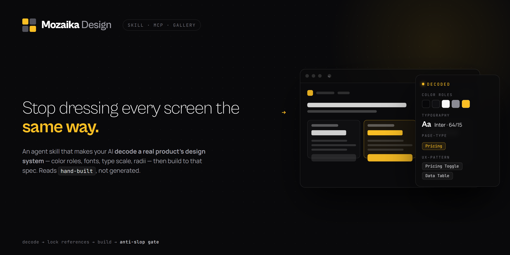

# Mozaika Design

[](LICENSE)
&nbsp;Works with **Claude Code · Cursor · Codex · Gemini CLI** and any MCP-compatible agent.

Your agent ships an app that works — and a UI that is embarrassing. Centered stack, soft
gradient on white, three identical cards, Inter at 400/600, default radius. You can spot
it instantly, and so can your users.

This skill is the method layer we built to fix that in our own product, released as-is
under MIT. It makes the agent **decode a real product's design system first** — color
roles, fonts, measured type scale and weights, radii, section layout — **lock that spec,
build to it, and screen the result against an anti-slop gate**. The core discipline:
every visible decision traces to a real product or a craft rule, never to the model's
default. Defaults are where slop comes from.

It pairs with the [Mozaika MCP](https://mozaika.design/connect), which serves design
systems **measured from the live DOM** — measured, not hallucinated. The corpus behind
it today: **588 real products, 3,873 decoded sections, 548 measured design systems**.
The MCP has a real free tier (no card). The method itself needs no account at all.

## Install

```bash
npx skills add https://github.com/sezabut/mozaika-design
```

Or manually — copy this repo into your skills directory:

```bash
git clone https://github.com/sezabut/mozaika-design.git
# personal (all projects):
cp -r mozaika-design ~/.claude/skills/mozaika-design
# or per-project:
cp -r mozaika-design your-project/.claude/skills/mozaika-design
```

Craft rules and the method load immediately. No account, no key, no telemetry — it is a
folder of markdown.

## The method

1. **Frame** — Subject · Audience · Job · Concept · **Signature**, in one sentence, before any code.
2. **Decode** — get a real product's design system as data (via the MCP, or hand-decoded from references you paste). Never design in a vacuum.
3. **Lock** — a short reference list every later decision must trace back to.
4. **Route** — small edit → straight to code; open-ended → 3 directions, build the boldest.
5. **Craft** — typography, color, spacing, motion, copy, icons: specific, non-negotiable defaults in [`references/`](references/).
6. **QA gate** — name the one decision that makes it look hand-built; trace everything else; fix or cut what traces to nothing.

Full method: [`SKILL.md`](SKILL.md). A complete worked run:
[`references/example-workflow.md`](references/example-workflow.md).

## Receipts

This method wasn't written as advice; it is how we test our own product. The claims below
are from our dogfood loop (July 2026), described in words — the side-by-side images will
be added to `assets/receipts/` and nothing is described here that we didn't run.

- **Three agents, three brands, kits only.** Three independent agents were each given only
  a decoded kit (DESIGN.md + Tailwind theme + section specs) for Linear, Mercury, and
  Vercel — no access to the real sites — and asked to build landing pages. A separate
  multimodal review judged all three on-brand and free of the standard AI tells: Linear's
  build used a single indigo as selection color only; Mercury's kept its periwinkle
  strictly on clickable elements; Vercel's came out as a Swiss-blueprint deploy dashboard,
  not a gradient hero. The same run also exposed a real gap (color *roles* without usage
  guidance made agents guess which color acts) — which we then fixed in the data, not the
  prose.
- **The audit quote.** After we added measured typography to the corpus, a fresh agent
  rebuilt Mercury from the enriched kit and reported, unprompted: **"weights given, not
  guessed — used the real 480/420, not 400/600."** That sentence is the whole thesis.
- **Replica loop.** An agent connected to the live MCP the way a customer would and
  rebuilt Linear's landing from the kit alone; we keep the side-by-side hero comparison
  from that run.
- **The measurements are real.** The corpus behind the MCP carries type measured from the
  live DOM via computed-style probes: Linear's hero is 64px at weight **510**, tracking
  **−1.41px**, on a 300/400/510/590 weight ladder with a 128px section rhythm. Vercel
  tracks its hero at **−3.84px**. Stripe's display weight is **300**. Across 548 measured design
  systems the weight ladders run 200→900 — which is exactly why an agent's "Inter
  400/600" habit reads as slop.

Honest caveats: the loop, the judging, and the fixes are ours; treat this as a documented
internal test, not a third-party benchmark. The method raises the floor reliably; it does
not guarantee a world-class screen every run. The QA gate exists because the last judge
is a human looking at the result.

## How it degrades without the MCP

Designed to fail soft. What changes when no MCP is connected:

| | With the Mozaika MCP | Without it |
|---|---|---|
| Craft rules + anti-slop gate | yes | yes — identical |
| The six-step method | yes | yes — identical |
| Design systems | measured from the live DOM: exact hexes with usage semantics, real weights/tracking, radius sets | hand-decoded from screenshots/CSS the user pastes, or recalled from products the agent genuinely knows — and labeled as such |
| Sections | decoded section specs + reference image + parent tokens in one call | the user's pasted references, hand-decoded into the same kit shape |
| Cross-product research | ranked panels of how the best products solve one section | the agent names 3 real products and reasons from their specifics out loud |
| Honesty floor | measured | the skill requires the agent to say "recalled, not measured" instead of silently guessing |

The skill's degraded mode includes a hand-decode kit template, so "paste two screenshots
of products you want to feel like" is a first-class path, not a fallback shrug.

## The grounded path (free tier)

Get a free MCP key at [mozaika.design/connect](https://mozaika.design/connect) — no card.
The free tier is real: **25 tool calls a month** on a rotating open shelf of **30 decoded
design systems**, unlimited search. A typical decode-and-build run uses 3–6 calls, so a
full build fits comfortably. Gated calls return a structured note (what's on the free
shelf, what's left this month) instead of failing silently.

**Claude Code**
```bash
claude mcp add --transport http mozaika https://mozaika.design/mcp \
  --header "Authorization: Bearer <your_mcp_token>"
```

**Cursor** — add to `.cursor/mcp.json`:
```json
{
  "mcpServers": {
    "mozaika": {
      "url": "https://mozaika.design/mcp",
      "headers": { "Authorization": "Bearer <your_mcp_token>" }
    }
  }
}
```

**Other tools** — `URL: https://mozaika.design/mcp`, `Auth: Bearer <your_mcp_token>`.

Tools: `get_design_system`, `get_section`, `compare_sections`, `search_screens`,
`get_product`, plus screens/flows helpers — see
[`references/mcp-tools.md`](references/mcp-tools.md). Copy-paste starting prompts:
[`examples/prompts.md`](examples/prompts.md).

## What's inside

- [`SKILL.md`](SKILL.md) — the decode-first method and the QA gate.
- [`references/anti-ai-slop.md`](references/anti-ai-slop.md) — the tells of AI-generated UI, and the fixes.
- [`references/typography.md`](references/typography.md) · [`color.md`](references/color.md) · [`spacing-layout.md`](references/spacing-layout.md) · [`motion.md`](references/motion.md) · [`copywriting.md`](references/copywriting.md) · [`icons.md`](references/icons.md) — craft defaults.
- [`references/example-workflow.md`](references/example-workflow.md) — the loop, run end-to-end on a pricing page.
- [`references/mcp-tools.md`](references/mcp-tools.md) — driving the Mozaika MCP well.
- [`examples/prompts.md`](examples/prompts.md) — copy-paste prompts pairing the skill with the MCP.

## FAQ

**Is this free?** Yes. The method — SKILL.md, every craft guide, the workflow — is MIT.
Use it, fork it, ship it in commercial work, no account.

**Then what's paid?** The data. Mozaika's corpus of design systems measured from live
production DOMs (the exact hexes with usage semantics, the real 510s and −1.41s, section
specs, flows) is the product. The free tier gives you 25 calls/month on a 30-system
shelf; the full library with unlimited calls is a flat subscription at
[mozaika.design](https://mozaika.design) — no credits, retries never billed.

**Why open-source the method?** Because the method is craft, and craft should spread.
Our moat isn't the advice, it's the measurements. If the method alone makes your agent's
UI better, good — that's the point. If you want it grounded in measured systems instead
of recalled ones, the MCP is one free key away.

**Does it work without Claude Code?** The skill format is Claude Code-native, but the
files are plain markdown — Cursor rules, Codex instructions, or a system prompt can load
the same method. The MCP works with any MCP client.

**Does the skill phone home?** No. It is markdown. Network calls only happen if you
connect the MCP, with your key, explicitly.

**Can I contribute?** Yes — sharper slop tells, better craft defaults, and honest
counter-examples are welcome as PRs. Keep the voice: specific, measured, no hype.

## License

MIT — see [LICENSE](LICENSE). The Mozaika data corpus is not part of this repository.

---

Built by [Sam C](https://x.com/sezabut) at [Mozaika](https://mozaika.design) — measured, not hallucinated.
